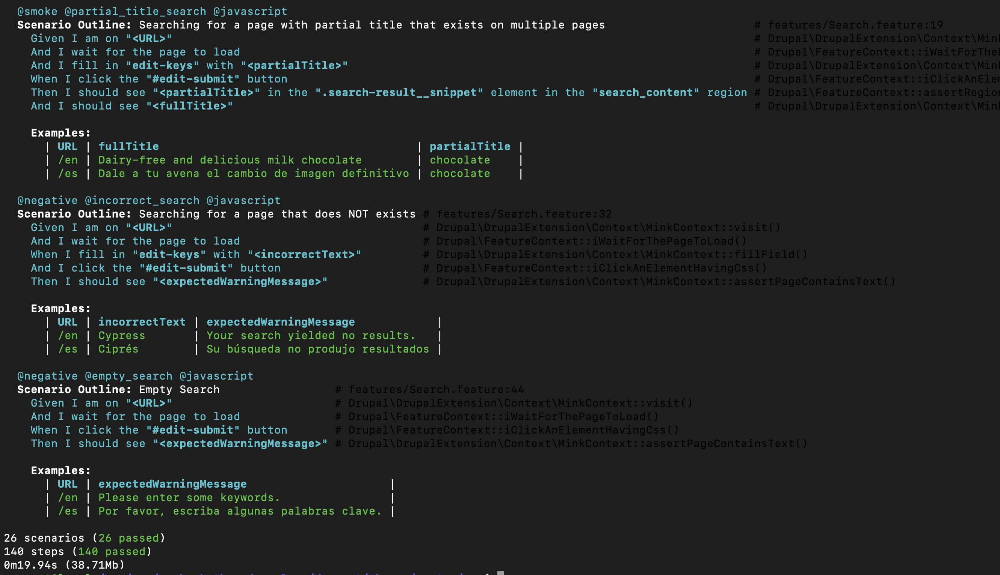
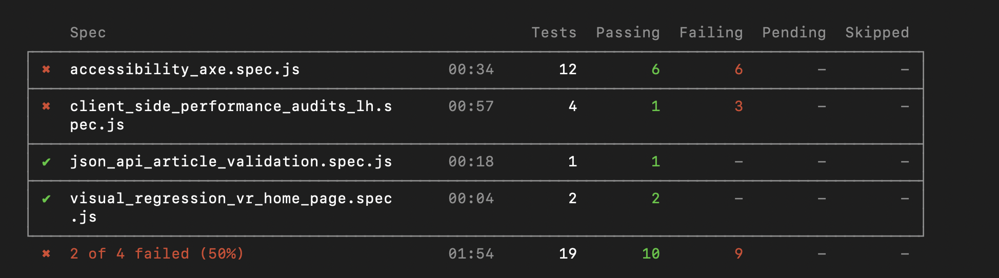
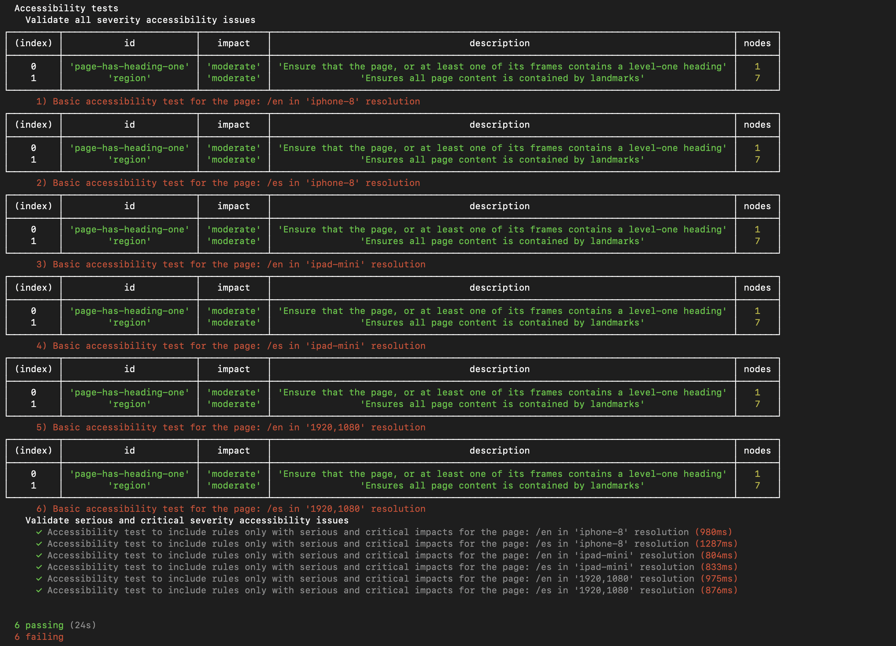
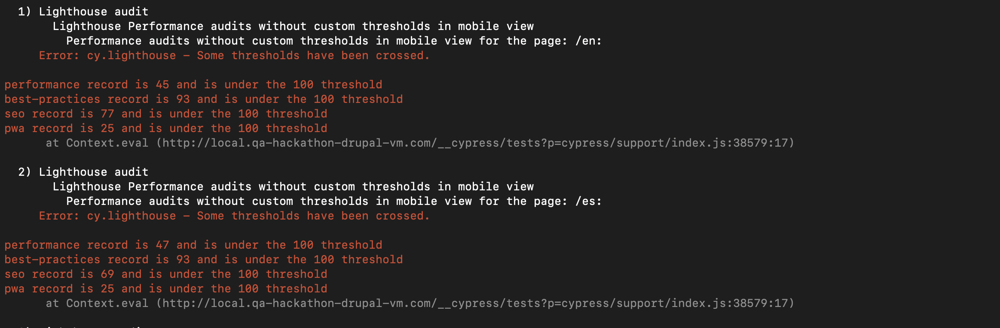

# Full-Stack automated tests implementation for a bilingual site


## About project set-up:
   * This project is built with [BLT 11.x](https://docs.acquia.com/blt/), an open-source project template and tool that enables building, testing, and deploying drupal installations following acquia professional services best practices.
   * Please refer and follow this [READ ME](/SetUp_README.md) for local set-up using Drupal VM.
   * A bilingual site used in our demonstration is built with [Umami Installation Profile](https://www.drupal.org/project/demo_umami)

## About automated tests:

* **Testing Frameworks:**

  * [behat](https://docs.behat.org/en/latest/) - Covers acceptance tests
  * [cypress.io](https://www.cypress.io/)  - Covers accessibility, lighthouse client side performance, JSON:API and Visual tests


* Base url of the site(after local set-up): http://local.qa-hackathon-drupal-vm.com

## Implementation of acceptance tests with behat:



* Features belongs to **behat** are tagged with the following primary tags and which covers in both "English" & "Spanish" sites

    * @contact_us_form => Covers contact us form submission with positive and negative cases
    * @create-article => Covers create and verify the article through UI
    * @header_footer => Covers header and footer elements in several pages
    * @basic_search => Covers basic search scenarios in detail

### BLT commands for behat tests

* Test execution using tags:

```
  $ blt tests:behat:run -D behat.tags=@create-article
  $ blt tests:behat:run -D behat.tags=@header_footer
  $ blt tests:behat:run -D behat.tags=@contact_us_form
  $ blt tests:behat:run -D behat.tags=@basic_search

```
* Test execution using feature file names:

```

  $ blt tests:behat:run -D behat.paths=Article.feature
  $ blt tests:behat:run -D behat.paths=Contact.feature
  $ blt tests:behat:run -D behat.paths=HeaderAndFooter.feature
  $ blt tests:behat:run -D behat.paths=Search.feature

```
  **Note:**
  * Please refer [example.local.yml file](tests/behat/example.local.yml) for configuration pertaining to the behat tests and also look into this [BLT-Automated Testing documentation](https://docs.acquia.com/blt/developer/testing/) for various useful commands, best practices, and test directory structure in detail.
  * While executing behat tests, it may be required to override respective methods in 'Behat.php' or 'Command.php' file, if you are interested to implement the  features like junit report generation, proceed the test execution by disabling `--stop-on-failure`.Please refer this [open bug](https://github.com/acquia/blt-behat/issues/5) for the similar context.

## Implementation of accessibility, client side performance, JSON:API & visual tests with Cypress.io:

  

  * accessibility.spec.js => **About the implementation of accessibility tests** for Home page with various viewports using [cypress-axe](https://www.npmjs.com/package/cypress-axe)

  
  **Note:**
      In order to fix the accessibility failures, execute this test in interactive mode by command ```npx cypress open``` from your local file system path '/docroot/themes/custom/axe' where we can identify all the respective ui elements belongs to the accessibility failures along with it's [root cause axe rules](https://dequeuniversity.com/rules/axe/) as below.

  

  * client_side_performance_audits_lh.spec.js => **About the implementation of lighthouse performance audit tests** for Home page in both Desktop and Mobile viewports using [cypress-audit](https://www.npmjs.com/package/cypress-audit)
    
      **Note:**
        After the lighthouse client side performance tests execution, we can observe the failure tests along with it's [html report](demo_evidence/lh-desktop-httplocalqahackathondrupalvmcomen-2021-09-07.html) which will be generated under the run time created directory: "perf-reports" and this will be helpful while fix these issues.


  * json_api_article_validation.spec.js => **About the implementation of JSON:API tests along with managing(create/delete) users using drush commands** in article page
    

     **Note:**
        As a pre-requisite of these JSON:API tests, [JSON:API Module](https://www.drupal.org/project/jsonapi) needs to be enabled and configured to handle all the basic operations('GET', 'POST', 'DELETE', etc) to be performed.


  * visual_regression_vr_home_page.spec.js => **About the implementation of visual tests** for Home Page using [Applitools](https://applitools.com/)

    **Notes:**
      * Set the value of an environment variable "APPLITOOLS_API_KEY" based on OS as mentioned [here](https://www.npmjs.com/package/@applitools/eyes-cypress) or set this in [.as-a.ini file](docroot/themes/custom/axe/.as-a.ini).
      Please refer our other blog about [a guide to visual testing for drupal sites](https://applitools.com/blog/automated-testing-drupal-applitools/) for more detail.
      * While performing visual tests with applitools, accessibility testing can also be addressed by enabling [applitools contrast advisor feature](https://applitools.com/docs/features/contrast-accessibility.html).


   * During execution, cypress comes with the ability to generate the screenshots(for failure tests only) and videos (for all tests) under [cypress directory](docroot/themes/custom/axe/cypress) by default. Currently, the tests execution videos won't get generated as the "video" key in  [cypress.json file](docroot/themes/custom/axe/cypress.json) is set as "false". Please modify that "true" and observe the videos if you are interested. Also while we execute the tests from the localized Drupal VM environment(after make the vagrant ssh connection), the generated videos for the tests may be blank/not fully generated and this may be due to several factors. Example, size of CPU cores in VM, older version of chromedriver/cypress configured in the project. Please refer [this](https://docs.cypress.io/guides/guides/screenshots-and-videos) for more detail.


### BLT commands for front-end tasks

  * Following command executes 'source:build:frontend-reqs' target hook from [blt.yml](blt/blt.yml) which takes care of installing "npm related dependencies".
```
  $ blt source:build:frontend-reqs
```
  * Following command executes 'source:build:frontend-test' target hook from [blt.yml](blt/blt.yml) which is referred to execute **all the above cypress tests** with ```npm test``` command referred from [package.json file](docroot/themes/custom/axe/package.json). Acquia blt also provides support for creating custom hooks which helps to execute the specific tests(example, only execute accessibility tests) and please refer [how to add custom hook](https://docs.acquia.com/blt/extending-blt/#blt-add-robo-hook) for the same. For all the front-end related configuration, please refer [BLT-front-end documentation](https://docs.acquia.com/blt/developer/frontend/).
```
  $ blt tests:frontend
```